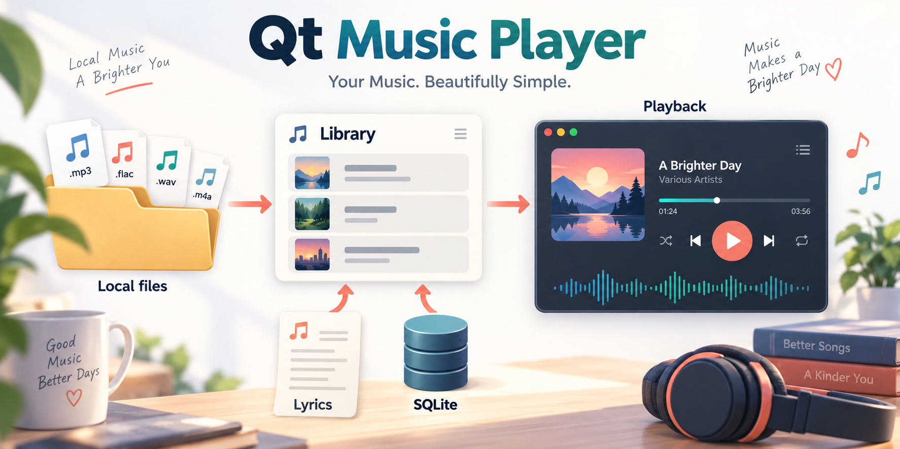
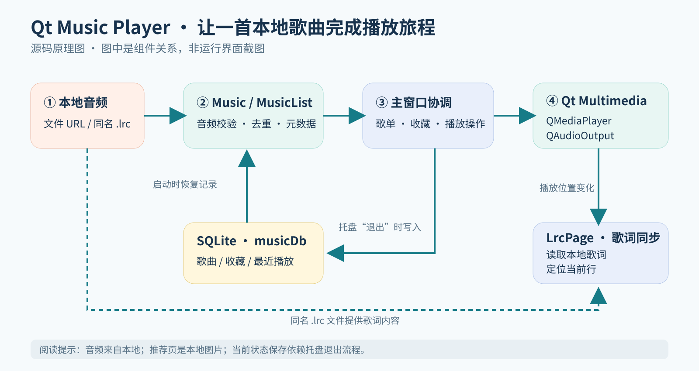

# Qt Music Player

**以 Qt Widgets 构建的本地音乐播放器。** 从导入音频、整理歌单到播放与歌词显示，串起一个桌面音乐应用的核心使用流程。




*主题插画用于呈现项目风格，不是程序运行截图。*

本项目是一个仿 QQ 音乐界面风格的桌面应用学习作品，重点是本地音频播放、信号与槽、组件化界面和 SQLite 状态保存。项目展示名与仓库名使用 **Qt Music Player / qt-music-player**；源码工程和可执行文件仍保留历史名称 `Video_to_MP3_music`。

## 功能

| 功能 | 当前实现 |
| --- | --- |
| 本地音乐库 | 多文件导入、音频 MIME 类型检查、按文件 URL 去重、读取歌名/歌手/专辑元数据 |
| 播放控制 | 播放与暂停、上一首/下一首、双击歌曲播放、当前歌单播放全部 |
| 播放模式 | 列表循环、随机播放、单曲循环 |
| 歌单视图 | 本地音乐、我喜欢、最近播放；历史记录按最近播放时间排序 |
| 播放信息 | 音量与静音、总时长与当前时间、进度拖动、媒体封面与默认封面 |
| 歌词 | 读取音频旁的同名 `.lrc` 文件，随播放位置显示当前行及相邻歌词 |
| 桌面交互 | 无边框窗口、窗口拖动、最小化、托盘还原/退出、单实例检查 |
| 本地状态 | SQLite 保存歌曲记录、收藏状态和最近播放时间 |

以上列出的是当前源码中的实现。这里没有在线曲库、QQ 账户登录、音乐下载服务或视频转 MP3 功能；推荐页展示的是本地图片卡片与动画，换肤和最大化按钮尚未实现。

## 架构



主窗口负责协调播放器、歌单页面和数据库。页面通过信号与槽发出播放、收藏和进度操作，歌曲信息集中在 `MusicList` 中。

| 模块 | 职责 |
| --- | --- |
| `Video_to_MP3_music` | 主窗口、播放列表切换、播放控制、页面协作、SQLite 初始化 |
| `Music` / `MusicList` | 歌曲模型、元数据读取、URL 去重、按 ID 查找、数据库读写 |
| `commonPage` / `listItemBox` | 本地、收藏、历史歌单及歌曲条目的展示与交互 |
| `LrcPage` | 本地 LRC 文件解析、按播放位置匹配歌词行 |
| `musicSlider` / `volumeTool` | 进度、音量与静音控件 |
| `musicForm` / `recBox` / `recBoxItem` | 侧边导航、动画和本地推荐图片卡片 |

核心数据流：

1. 导入文件 → `MusicList` 校验与去重 → `Music` 解析元数据 → 歌单页面刷新。
2. 选择歌曲 → 主窗口设置 `QMediaPlayer` 音源 → `QAudioOutput` 输出音频。
3. 播放位置变化 → 更新时间与进度 → `LrcPage` 同步歌词。
4. 通过托盘菜单退出 → 歌曲、收藏与历史状态写入 SQLite。

## 主要目录

```text
.
├── Music/                         # 已提交的 Windows 部署目录
│   ├── Video_to_MP3_music.exe      # 打包程序入口
│   ├── Qt6*.dll                    # Qt 运行库
│   ├── platforms/                 # Windows 平台插件
│   ├── multimedia/                # 音频后端插件
│   ├── sqldrivers/                # SQLite 等数据库驱动
│   └── musicDb                    # 初始 SQLite 数据库
├── Video_to_MP3_music/
│   ├── Video_to_MP3_music.pro      # qmake 工程文件
│   ├── main.cpp                   # QApplication 与单实例检查
│   ├── video_to_mp3_music.*        # 主窗口
│   ├── music.* / musiclist.*       # 歌曲与歌曲集合
│   ├── commonpage.* / listitembox.* # 歌单组件
│   ├── lrcpage.*                   # 歌词组件
│   ├── musicslider.* / volumetool.* # 播放控件
│   ├── iamges.qrc / images/        # 界面资源
│   └── build/                     # 历史构建产物与示例音频
├── docs/images/                   # README 主题视觉与架构图
└── 仿qq音乐项目.md                 # 原始开发记录
```

历史 `build/` 和 `.pro.user` 含开发环境生成的内容。源码构建请使用新建的构建目录和自己的 Qt Kit。

## 环境与验证状态

原开发记录使用 **Qt 6.9.2、MinGW 64-bit、qmake**，工程启用 **C++17**。源码依赖以下 Qt 模块：

- Qt Core、GUI、Widgets；
- Qt Multimedia：`QMediaPlayer`、`QAudioOutput`；
- Qt SQL 与 `QSQLITE` 驱动；
- Qt Network：在工程中声明，当前没有在线音乐请求实现。

播放依赖可用音频输出设备与 Qt 媒体后端；具体支持的音频格式由后端决定。SQLite 文件写在**启动时的工作目录**，该目录需要可写。

本说明已静态核对工程引用、资源文件、部署目录及初始数据库。**本次文档整理没有重新编译源码，也没有在干净 Windows 环境启动打包程序。** 以下提供与当前目录结构一致的操作步骤，不代表所有机器上的运行结果已获验证。当前仓库未提供自动化测试与 CI 配置。

## 获取项目

```bash
git clone https://github.com/759stronger/qt-music-player.git
cd qt-music-player
```

## 运行方式一：Windows 已打包程序

1. 克隆或下载仓库，保留 `Music/` 的完整内容；DLL 与插件目录需要和程序一起保存。
2. 在仓库根目录打开 PowerShell，执行：

```powershell
Set-Location .\Music
.\Video_to_MP3_music.exe
```

也可以进入 `Music/` 后双击可执行文件。命令方式明确指定工作目录，便于保持数据库位置一致。

`Music/musicDb` 的初始 `musicInfo` 表为空；首次打开后请导入自己的音频。导入不会把音频复制进数据库，数据库保存的是文件路径。移动音频后，旧记录不会自动跟随更新。

若提示缺少 DLL 或平台插件，先检查是否只复制了 `.exe`、部署子目录是否完整。若窗口未出现，也检查托盘是否已有实例；程序使用共享内存避免重复运行。

## 运行方式二：从源码构建

### 使用 Qt Creator

1. 安装 Qt 6.9.2 的 MinGW 64-bit 开发组件，包含 Qt Multimedia 与 Qt SQL。
2. 用 Qt Creator 打开 `Video_to_MP3_music/Video_to_MP3_music.pro`。
3. 选择对应的 **Desktop Qt 6.9.2 MinGW 64-bit Kit**，设置一个新的独立构建目录。
4. 选择 Release 配置，构建并运行。设置工作目录时选择可写位置；该位置用于保存 `musicDb`。

不要直接依赖仓库里已有的 `.pro.user`、Makefile 或历史构建缓存；它们来自原开发环境。

### 使用 qmake 命令

以下是 Windows / MinGW 的示例。从已配置好 Qt 6.9.2 与其配套 MinGW 环境的 **PowerShell** 执行，起点是仓库根目录。运行前确认 `qmake` 与 `mingw32-make` 来自对应的 Qt Kit。

```powershell
New-Item -ItemType Directory -Path .\build-qt-music-player -Force
Set-Location .\build-qt-music-player
qmake ..\Video_to_MP3_music\Video_to_MP3_music.pro "CONFIG+=release"
mingw32-make release
.\release\Video_to_MP3_music.exe
```

这是默认 Windows qmake 布局的 Release 路线。使用其他 Kit 时，产物目录可能不同，应以实际构建输出为准。

若需要把自己编译的程序拷到未安装 Qt 的机器，应使用**同一 Qt Kit**的 `windeployqt` 收集运行库与插件，并单独核对音频后端等第三方依赖。参考 [Qt qmake 官方说明](https://doc.qt.io/qt-6/qmake-running.html)和 [Qt Windows 部署指南](https://doc.qt.io/qt-6/windows-deployment.html)。

## 使用方式

1. 在“本地下载”页面点击添加本地音乐，选择音频文件。文件选择器会尝试定位工作目录上一级的 `localmusic/`，没有该目录时可手动浏览其他位置。
2. 双击歌曲或点击“播放全部”开始播放；底部控制区调整播放模式、进度、音量和静音。
3. 点击歌曲条目的收藏按钮，将歌曲加入“我喜欢”；播放记录显示在“最近播放”。
4. 要显示歌词，将标准 LRC 文件放在音频旁并使用相同文件名，例如 `demo.mp3` 与 `demo.lrc`，再打开歌词页面。
5. 完成演示后，从**系统托盘菜单选择“退出”**以保存状态。窗口右上角关闭按钮只隐藏窗口，程序仍会运行。

建议用自己有权使用的音频与简单的 `[mm:ss.xxx]歌词` LRC 文件开始演示。导入界面目前使用通用二进制 MIME 过滤器，导入后才进行 `audio/` 类型检查；格式支持与文件可选情况尚需在目标环境验证。

## 已知限制

- **本地播放范围：**没有账号、在线曲库、在线下载或视频转码；推荐卡片使用本地资源。
- **元数据等待：**导入与启动恢复会同步等待 `metaDataChanged` 信号，尚未设置超时或媒体错误退出路径。损坏文件、不可读取文件或后端异常可能使加载停留在等待状态。
- **保存时机：**新增歌曲、收藏与历史记录在托盘“退出”时统一写入数据库；异常终止可能丢失本次修改。
- **路径与数据库：**音乐记录使用本地文件路径，数据库位置依赖工作目录。换机器、移动音乐或改变启动目录，需要重新处理记录。
- **歌词与界面边界：**歌词解析较基础，复杂 LRC 标签、多时间戳和特殊精度尚未充分验证；换肤与最大化仍是占位功能。
- **可移植性：**当前保留 Windows / MinGW 构建与部署资料，未验证 Linux、macOS 或其他编译器；源码仍使用 `std::random_shuffle`，该接口已从 C++17 标准移除，严格的工具链可能需要兼容性调整。参见 [Microsoft C++ 标准库变更说明](https://devblogs.microsoft.com/cppblog/standard-library-algorithms-changes-and-additions-in-c17/)。

## 源码与素材许可

仓库目前尚未指定项目源码许可证，也未提供统一的音频、歌词、封面与界面素材授权清单。本文没有为现有源码或素材追加许可证。

Qt、FFmpeg 及其他随包依赖有各自的许可证与分发条件；再次分发程序前应分别核对。项目演示可以使用自行准备的授权音频与素材。

## 文档依据

本 README 按提交 `1d7eacc7a0fc0bf2e21dc411d26dbcb4ec0dbf5d` 的源码、资源与部署目录整理。原始学习过程见 [开发记录](仿qq音乐项目.md)；后续功能变化应同步更新本文。
